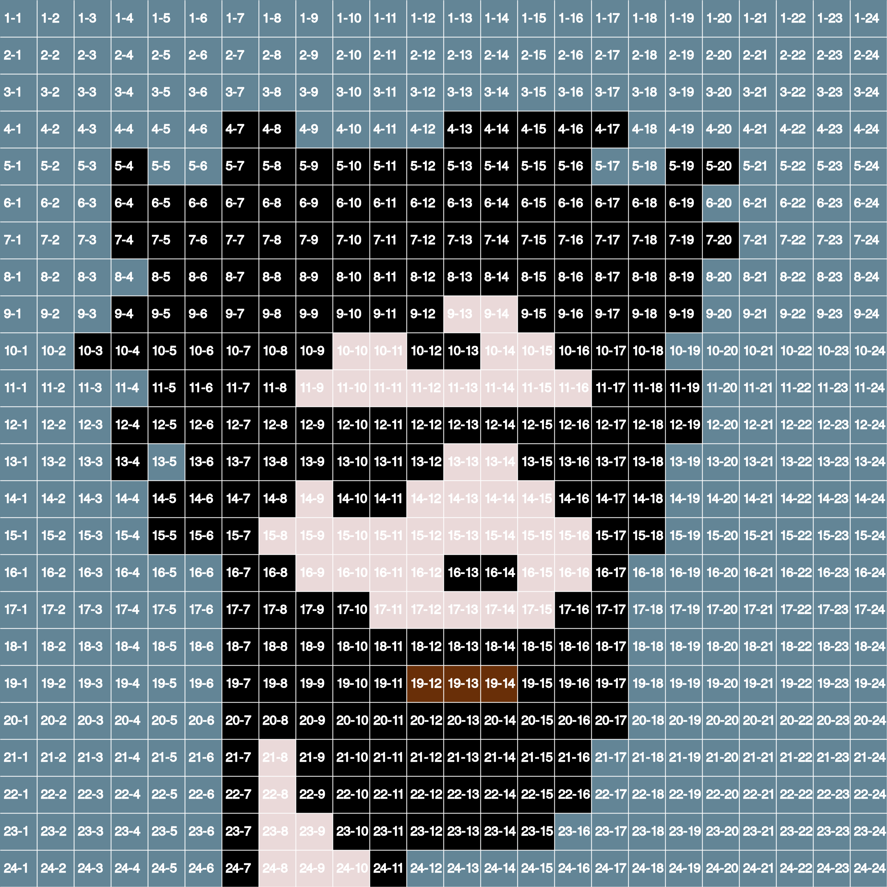

# CryptoPunk Pixels

## Why this repo?
Initially, I wanted to write an article about how I created the LoadingPunks collection.
However, it's more engaging and informative to demonstrate it through examples.
So, this repository does not create LoadingPunks, but it does include features that I needed to write the assembling feature (creating the GIF).

## What can you do with this repo?
This repository could be a good starting point for your own CryptoPunks derivative collection.
It allows you to get all pixel data layer by layer and even has the possibility to overwrite default colors.

## How I created LoadingPunks
### Extracting pixel data
Because I wanted to "load" each CryptoPunk layer by layer, I had to analyze all available attributes per gender; attributes go by gender, and Zombies, Apes, and Aliens are classified as Males.
I could automatically extract each 10,000 CryptoPunks and retrieve all pixels that have a different color than the background color, but that way I would only have flat images. Therefore, I came up with the idea to analyze each attribute manually and enter x-y coordinates in separate CSV files.
To avoid looking at my screen with a microscope and counting each pixel on screen, I created a simple function that overlays the CryptoPunk with x-y coordinates for each pixel. This allowed me to quickly see which x-y coordinates (and color) belong to a certain attribute.

_Insert CryptoPunk PNG files in /data/originals/ that are 336x336 pixels in dimension.
I've added one CryptoPunk solely for demonstration purposes._

With this repo you could do the same by running the following command in your kernel, although the x-y results you can already find in `data/properties`.

```text
php index.php rasterize 15
```



### Pulling pixel information
Next to attributes pixel data, I've also separated pixels for the skin, the type (silouete) and eyes, nose + mouth.
When I had all the information available, it was just a matter to collect all x-y + color data in the correct order.
With repo you can collect the same data and use in your own derivative.

_Tip: end your command with `pretty` to get readable output._

Get properties for CryptoPunk #15:
```text
php index.php get_properties 15

{"type":"Human","gender":"Male","skin":"Albino","attributes_count":"3 Attributes","accessories":["Luxurious Beard","Wild Hair","Regular Shades"]}
```

```text
php index.php get_properties 15 pretty

{
    "type": "Human",
    "gender": "Male",
    "skin": "Albino",
    "attributes_count": "3 Attributes",
    "accessories": [
        "Luxurious Beard",
        "Wild Hair",
        "Regular Shades"
    ]
}
```

Get pixel x-y + color data for the skin for CryptoPunk #15
```text
php index.php get_skin_pixels 15

[[7,9,"#EAD9D8",1],[7,10,"#EAD9D8",1],[7,11,"#EAD9D8",1],[7,12,"#EAD9D8",1],[7,13,"#EAD9D8",1],[7,14,"#EAD9D8",1],[7,15,"#EAD9D8",1],[8,8,"#EAD9D8",1],[8,9,"#EAD9D8",1],[8,10,"#EAD9D8",1],[8,11,"#EAD9D8",1],[8,12,"#EAD9D8",1],[8,13,"#EAD9D8",1],[8,14,"#EAD9D8",1],[8,15,"#EAD9D8",1],[8,16,"#EAD9D8",1],[9,8,"#EAD9D8",1],[9,9,"#EAD9D8",1],[9,10,"#EAD9D8",1],[9,11,"#EAD9D8",1],[9,12,"#EAD9D8",1],[9,13,"#EAD9D8",1],[9,14,"#EAD9D8",1],[9,15,"#EAD9D8",1],[9,16,"#EAD9D8",1],[10,8,"#EAD9D8",1],[10,9,"#EAD9D8",1],[10,10,"#EAD9D8",1],[10,11,"#EAD9D8",1],[10,12,"#EAD9D8",1],[10,13,"#EAD9D8",1],[10,14,"#EAD9D8",1],[10,15,"#EAD9D8",1],[10,16,"#EAD9D8",1],[11,8,"#EAD9D8",1],[11,9,"#EAD9D8",1],[11,10,"#EAD9D8",1],[11,11,"#EAD9D8",1],[11,12,"#EAD9D8",1],[11,13,"#EAD9D8",1],[11,14,"#EAD9D8",1],[11,15,"#EAD9D8",1],[11,16,"#EAD9D8",1],[12,8,"#EAD9D8",1],[12,9,"#EAD9D8",1],[12,10,"#EAD9D8",1],[12,11,"#EAD9D8",1],[12,12,"#EAD9D8",1],[12,13,"#EAD9D8",1],[12,14,"#EAD9D8",1],[12,15,"#EAD9D8",1],[12,16,"#EAD9D8",1],[13,7,"#EAD9D8",1],[13,8,"#EAD9D8",1],[13,9,"#EAD9D8",1],[13,10,"#EAD9D8",1],[13,11,"#EAD9D8",1],[13,12,"#EAD9D8",1],[13,13,"#EAD9D8",1],[13,14,"#EAD9D8",1],[13,15,"#EAD9D8",1],[13,16,"#EAD9D8",1],[14,7,"#EAD9D8",1],[14,8,"#EAD9D8",1],[14,9,"#EAD9D8",1],[14,10,"#EAD9D8",1],[14,11,"#EAD9D8",1],[14,12,"#EAD9D8",1],[14,13,"#EAD9D8",1],[14,14,"#EAD9D8",1],[14,15,"#EAD9D8",1],[14,16,"#EAD9D8",1],[15,8,"#EAD9D8",1],[15,9,"#EAD9D8",1],[15,10,"#EAD9D8",1],[15,11,"#EAD9D8",1],[15,12,"#EAD9D8",1],[15,13,"#EAD9D8",1],[15,14,"#EAD9D8",1],[15,15,"#EAD9D8",1],[15,16,"#EAD9D8",1],[16,8,"#EAD9D8",1],[16,9,"#EAD9D8",1],[16,10,"#EAD9D8",1],[16,11,"#EAD9D8",1],[16,12,"#EAD9D8",1],[16,13,"#EAD9D8",1],[16,14,"#EAD9D8",1],[16,15,"#EAD9D8",1],[16,16,"#EAD9D8",1],[17,8,"#EAD9D8",1],[17,9,"#EAD9D8",1],[17,10,"#EAD9D8",1],[17,11,"#EAD9D8",1],[17,12,"#EAD9D8",1],[17,13,"#EAD9D8",1],[17,14,"#EAD9D8",1],[17,15,"#EAD9D8",1],[17,16,"#EAD9D8",1],[18,8,"#EAD9D8",1],[18,9,"#EAD9D8",1],[18,10,"#EAD9D8",1],[18,11,"#EAD9D8",1],[18,12,"#EAD9D8",1],[18,13,"#EAD9D8",1],[18,14,"#EAD9D8",1],[18,15,"#EAD9D8",1],[18,16,"#EAD9D8",1],[19,8,"#EAD9D8",1],[19,9,"#EAD9D8",1],[19,10,"#EAD9D8",1],[19,11,"#EAD9D8",1],[19,12,"#EAD9D8",1],[19,13,"#EAD9D8",1],[19,14,"#EAD9D8",1],[19,15,"#EAD9D8",1],[19,16,"#EAD9D8",1],[20,8,"#EAD9D8",1],[20,9,"#EAD9D8",1],[20,10,"#EAD9D8",1],[20,11,"#EAD9D8",1],[20,12,"#EAD9D8",1],[20,13,"#EAD9D8",1],[20,14,"#EAD9D8",1],[20,15,"#EAD9D8",1],[20,16,"#EAD9D8",1],[21,8,"#EAD9D8",1],[21,9,"#EAD9D8",1],[21,10,"#EAD9D8",1],[21,11,"#EAD9D8",1],[21,12,"#EAD9D8",1],[21,13,"#EAD9D8",1],[21,14,"#EAD9D8",1],[21,15,"#EAD9D8",1],[22,8,"#EAD9D8",1],[22,9,"#EAD9D8",1],[22,10,"#EAD9D8",1],[23,8,"#EAD9D8",1],[23,9,"#EAD9D8",1],[23,10,"#EAD9D8",1],[24,8,"#EAD9D8",1],[24,9,"#EAD9D8",1],[24,10,"#EAD9D8",1],[8,10,"#FFFFFF",1],[9,9,"#FFFFFF",1]]
```

Get pixel x-y + color data for type for CryptoPunk #15
```text
php index.php get_type_pixels 15

[[6,9,"#111111",1],[6,10,"#111111",1],[6,11,"#111111",1],[6,12,"#111111",1],[6,13,"#111111",1],[6,14,"#111111",1],[6,15,"#111111",1],[7,8,"#111111",1],[7,16,"#111111",1],[8,7,"#111111",1],[8,17,"#111111",1],[9,7,"#111111",1],[9,17,"#111111",1],[10,7,"#111111",1],[11,7,"#111111",1],[12,7,"#111111",1],[13,6,"#111111",1],[14,6,"#111111",1],[15,6,"#111111",1],[15,7,"#111111",1],[16,7,"#111111",1],[17,7,"#111111",1],[18,7,"#111111",1],[19,7,"#111111",1],[20,7,"#111111",1],[21,7,"#111111",1],[22,7,"#111111",1],[23,7,"#111111",1],[24,7,"#111111",1],[10,17,"#111111",1],[11,17,"#111111",1],[12,17,"#111111",1],[13,17,"#111111",1],[14,17,"#111111",1],[15,17,"#111111",1],[16,17,"#111111",1],[17,17,"#111111",1],[18,17,"#111111",1],[19,17,"#111111",1],[20,17,"#111111",1],[21,16,"#111111",1],[22,15,"#111111",1],[22,14,"#111111",1],[22,13,"#111111",1],[22,12,"#111111",1],[22,11,"#111111",1],[23,11,"#111111",1],[24,11,"#111111",1]]
```

Get pixel x-y + color data for eyes, nose & mouth for CryptoPunk #15
```text
php index.php get_eyes_nose_mouth_pixels 15

[[16,13,"#111111",1],[16,14,"#111111",1],[19,12,"#111111",1],[19,13,"#111111",1],[19,14,"#111111",1],[13,10,"#111111",1],[13,15,"#111111",1],[12,10,"#A58D8C",1],[12,11,"#A58D8C",1],[12,15,"#A58D8C",1],[12,16,"#A58D8C",1],[13,11,"#CAB2B1",1],[13,16,"#CAB2B1",1]]
```

Get pixel x-y + color data for type for CryptoPunk #15
```text
php index.php get_accessories_pixels 15

{"Luxurious Beard":[[16,8,"#111111",1],[17,8,"#111111",1],[17,9,"#111111",1],[17,10,"#111111",1],[17,16,"#111111",1],[17,17,"#111111",1],[18,8,"#111111",1],[18,9,"#111111",1],[18,10,"#111111",1],[18,11,"#111111",1],[18,12,"#111111",1],[18,13,"#111111",1],[18,14,"#111111",1],[18,15,"#111111",1],[18,16,"#111111",1],[18,17,"#111111",1],[19,8,"#111111",1],[19,9,"#111111",1],[19,10,"#111111",1],[19,11,"#111111",1],[19,15,"#111111",1],[19,16,"#111111",1],[19,17,"#111111",1],[20,8,"#111111",1],[20,9,"#111111",1],[20,10,"#111111",1],[20,11,"#111111",1],[20,12,"#111111",1],[20,13,"#111111",1],[20,14,"#111111",1],[20,15,"#111111",1],[20,16,"#111111",1],[20,17,"#111111",1],[21,9,"#111111",1],[21,10,"#111111",1],[21,11,"#111111",1],[21,12,"#111111",1],[21,13,"#111111",1],[21,14,"#111111",1],[21,15,"#111111",1],[21,16,"#111111",1],[22,9,"#111111",1],[22,10,"#111111",1],[22,11,"#111111",1],[22,12,"#111111",1],[22,13,"#111111",1],[22,14,"#111111",1],[22,15,"#111111",1],[22,16,"#111111",1],[23,10,"#111111",1],[23,11,"#111111",1],[23,12,"#111111",1],[23,13,"#111111",1],[23,14,"#111111",1],[23,15,"#111111",1],[19,12,"#692F08",1],[19,13,"#692F08",1],[19,14,"#692F08",1]],"Wild Hair":[[4,7,"#111110",1],[4,8,"#111110",1],[4,13,"#111110",1],[4,14,"#111110",1],[4,15,"#111110",1],[4,16,"#111110",1],[4,17,"#111110",1],[5,4,"#111110",1],[5,7,"#111110",1],[5,8,"#111110",1],[5,9,"#111110",1],[5,10,"#111110",1],[5,11,"#111110",1],[5,12,"#111110",1],[5,13,"#111110",1],[5,14,"#111110",1],[5,15,"#111110",1],[5,16,"#111110",1],[5,19,"#111110",1],[5,20,"#111110",1],[6,4,"#111110",1],[6,5,"#111110",1],[6,6,"#111110",1],[6,7,"#111110",1],[6,8,"#111110",1],[6,9,"#111110",1],[6,10,"#111110",1],[6,11,"#111110",1],[6,12,"#111110",1],[6,13,"#111110",1],[6,14,"#111110",1],[6,15,"#111110",1],[6,16,"#111110",1],[6,17,"#111110",1],[6,18,"#111110",1],[6,19,"#111110",1],[7,4,"#111110",1],[7,5,"#111110",1],[7,6,"#111110",1],[7,7,"#111110",1],[7,8,"#111110",1],[7,9,"#111110",1],[7,10,"#111110",1],[7,11,"#111110",1],[7,12,"#111110",1],[7,13,"#111110",1],[7,14,"#111110",1],[7,15,"#111110",1],[7,16,"#111110",1],[7,17,"#111110",1],[7,18,"#111110",1],[7,19,"#111110",1],[7,20,"#111110",1],[8,5,"#111110",1],[8,6,"#111110",1],[8,7,"#111110",1],[8,8,"#111110",1],[8,9,"#111110",1],[8,10,"#111110",1],[8,11,"#111110",1],[8,12,"#111110",1],[8,13,"#111110",1],[8,14,"#111110",1],[8,15,"#111110",1],[8,16,"#111110",1],[8,17,"#111110",1],[8,18,"#111110",1],[8,19,"#111110",1],[9,4,"#111110",1],[9,5,"#111110",1],[9,6,"#111110",1],[9,7,"#111110",1],[9,8,"#111110",1],[9,9,"#111110",1],[9,10,"#111110",1],[9,11,"#111110",1],[9,12,"#111110",1],[9,15,"#111110",1],[9,16,"#111110",1],[9,17,"#111110",1],[9,18,"#111110",1],[9,19,"#111110",1],[10,3,"#111110",1],[10,4,"#111110",1],[10,5,"#111110",1],[10,6,"#111110",1],[10,7,"#111110",1],[10,8,"#111110",1],[10,9,"#111110",1],[10,12,"#111110",1],[10,13,"#111110",1],[10,16,"#111110",1],[10,17,"#111110",1],[10,18,"#111110",1],[11,5,"#111110",1],[11,6,"#111110",1],[11,7,"#111110",1],[11,8,"#111110",1],[11,17,"#111110",1],[11,18,"#111110",1],[11,19,"#111110",1],[12,4,"#111110",1],[12,5,"#111110",1],[12,6,"#111110",1],[12,7,"#111110",1],[12,8,"#111110",1],[12,17,"#111110",1],[12,18,"#111110",1],[12,19,"#111110",1],[13,4,"#111110",1],[13,6,"#111110",1],[13,7,"#111110",1],[13,8,"#111110",1],[13,17,"#111110",1],[13,18,"#111110",1],[14,5,"#111110",1],[14,6,"#111110",1],[14,7,"#111110",1],[14,8,"#111110",1],[14,17,"#111110",1],[14,18,"#111110",1],[15,5,"#111110",1],[15,6,"#111110",1],[15,7,"#111110",1],[15,17,"#111110",1],[15,18,"#111110",1]],"Regular Shades":[[12,6,"#111111",1],[12,7,"#111111",1],[12,8,"#111111",1],[12,9,"#111111",1],[12,10,"#111111",1],[12,11,"#111111",1],[12,12,"#111111",1],[12,13,"#111111",1],[12,14,"#111111",1],[12,15,"#111111",1],[12,16,"#111111",1],[12,17,"#111111",1],[12,18,"#111111",1],[13,9,"#111111",1],[13,10,"#111111",1],[13,11,"#111111",1],[13,12,"#111111",1],[13,15,"#111111",1],[13,16,"#111111",1],[13,17,"#111111",1],[13,18,"#111111",1],[14,10,"#111111",1],[14,11,"#111111",1],[14,16,"#111111",1],[14,17,"#111111",1]]}
```

Get all pixel x-y + color data for CryptoPunk #15
```text
php index.php get_pixels 15

{"Type":[[6,9,"#111111",1],[6,10,"#111111",1],[6,11,"#111111",1],[6,12,"#111111",1],[6,13,"#111111",1],[6,14,"#111111",1],[6,15,"#111111",1],[7,8,"#111111",1],[7,16,"#111111",1],[8,7,"#111111",1],[8,17,"#111111",1],[9,7,"#111111",1],[9,17,"#111111",1],[10,7,"#111111",1],[11,7,"#111111",1],[12,7,"#111111",1],[13,6,"#111111",1],[14,6,"#111111",1],[15,6,"#111111",1],[15,7,"#111111",1],[16,7,"#111111",1],[17,7,"#111111",1],[18,7,"#111111",1],[19,7,"#111111",1],[20,7,"#111111",1],[21,7,"#111111",1],[22,7,"#111111",1],[23,7,"#111111",1],[24,7,"#111111",1],[10,17,"#111111",1],[11,17,"#111111",1],[12,17,"#111111",1],[13,17,"#111111",1],[14,17,"#111111",1],[15,17,"#111111",1],[16,17,"#111111",1],[17,17,"#111111",1],[18,17,"#111111",1],[19,17,"#111111",1],[20,17,"#111111",1],[21,16,"#111111",1],[22,15,"#111111",1],[22,14,"#111111",1],[22,13,"#111111",1],[22,12,"#111111",1],[22,11,"#111111",1],[23,11,"#111111",1],[24,11,"#111111",1]],"Skin":[[7,9,"#EAD9D8",1],[7,10,"#EAD9D8",1],[7,11,"#EAD9D8",1],[7,12,"#EAD9D8",1],[7,13,"#EAD9D8",1],[7,14,"#EAD9D8",1],[7,15,"#EAD9D8",1],[8,8,"#EAD9D8",1],[8,9,"#EAD9D8",1],[8,10,"#EAD9D8",1],[8,11,"#EAD9D8",1],[8,12,"#EAD9D8",1],[8,13,"#EAD9D8",1],[8,14,"#EAD9D8",1],[8,15,"#EAD9D8",1],[8,16,"#EAD9D8",1],[9,8,"#EAD9D8",1],[9,9,"#EAD9D8",1],[9,10,"#EAD9D8",1],[9,11,"#EAD9D8",1],[9,12,"#EAD9D8",1],[9,13,"#EAD9D8",1],[9,14,"#EAD9D8",1],[9,15,"#EAD9D8",1],[9,16,"#EAD9D8",1],[10,8,"#EAD9D8",1],[10,9,"#EAD9D8",1],[10,10,"#EAD9D8",1],[10,11,"#EAD9D8",1],[10,12,"#EAD9D8",1],[10,13,"#EAD9D8",1],[10,14,"#EAD9D8",1],[10,15,"#EAD9D8",1],[10,16,"#EAD9D8",1],[11,8,"#EAD9D8",1],[11,9,"#EAD9D8",1],[11,10,"#EAD9D8",1],[11,11,"#EAD9D8",1],[11,12,"#EAD9D8",1],[11,13,"#EAD9D8",1],[11,14,"#EAD9D8",1],[11,15,"#EAD9D8",1],[11,16,"#EAD9D8",1],[12,8,"#EAD9D8",1],[12,9,"#EAD9D8",1],[12,10,"#EAD9D8",1],[12,11,"#EAD9D8",1],[12,12,"#EAD9D8",1],[12,13,"#EAD9D8",1],[12,14,"#EAD9D8",1],[12,15,"#EAD9D8",1],[12,16,"#EAD9D8",1],[13,7,"#EAD9D8",1],[13,8,"#EAD9D8",1],[13,9,"#EAD9D8",1],[13,10,"#EAD9D8",1],[13,11,"#EAD9D8",1],[13,12,"#EAD9D8",1],[13,13,"#EAD9D8",1],[13,14,"#EAD9D8",1],[13,15,"#EAD9D8",1],[13,16,"#EAD9D8",1],[14,7,"#EAD9D8",1],[14,8,"#EAD9D8",1],[14,9,"#EAD9D8",1],[14,10,"#EAD9D8",1],[14,11,"#EAD9D8",1],[14,12,"#EAD9D8",1],[14,13,"#EAD9D8",1],[14,14,"#EAD9D8",1],[14,15,"#EAD9D8",1],[14,16,"#EAD9D8",1],[15,8,"#EAD9D8",1],[15,9,"#EAD9D8",1],[15,10,"#EAD9D8",1],[15,11,"#EAD9D8",1],[15,12,"#EAD9D8",1],[15,13,"#EAD9D8",1],[15,14,"#EAD9D8",1],[15,15,"#EAD9D8",1],[15,16,"#EAD9D8",1],[16,8,"#EAD9D8",1],[16,9,"#EAD9D8",1],[16,10,"#EAD9D8",1],[16,11,"#EAD9D8",1],[16,12,"#EAD9D8",1],[16,13,"#EAD9D8",1],[16,14,"#EAD9D8",1],[16,15,"#EAD9D8",1],[16,16,"#EAD9D8",1],[17,8,"#EAD9D8",1],[17,9,"#EAD9D8",1],[17,10,"#EAD9D8",1],[17,11,"#EAD9D8",1],[17,12,"#EAD9D8",1],[17,13,"#EAD9D8",1],[17,14,"#EAD9D8",1],[17,15,"#EAD9D8",1],[17,16,"#EAD9D8",1],[18,8,"#EAD9D8",1],[18,9,"#EAD9D8",1],[18,10,"#EAD9D8",1],[18,11,"#EAD9D8",1],[18,12,"#EAD9D8",1],[18,13,"#EAD9D8",1],[18,14,"#EAD9D8",1],[18,15,"#EAD9D8",1],[18,16,"#EAD9D8",1],[19,8,"#EAD9D8",1],[19,9,"#EAD9D8",1],[19,10,"#EAD9D8",1],[19,11,"#EAD9D8",1],[19,12,"#EAD9D8",1],[19,13,"#EAD9D8",1],[19,14,"#EAD9D8",1],[19,15,"#EAD9D8",1],[19,16,"#EAD9D8",1],[20,8,"#EAD9D8",1],[20,9,"#EAD9D8",1],[20,10,"#EAD9D8",1],[20,11,"#EAD9D8",1],[20,12,"#EAD9D8",1],[20,13,"#EAD9D8",1],[20,14,"#EAD9D8",1],[20,15,"#EAD9D8",1],[20,16,"#EAD9D8",1],[21,8,"#EAD9D8",1],[21,9,"#EAD9D8",1],[21,10,"#EAD9D8",1],[21,11,"#EAD9D8",1],[21,12,"#EAD9D8",1],[21,13,"#EAD9D8",1],[21,14,"#EAD9D8",1],[21,15,"#EAD9D8",1],[22,8,"#EAD9D8",1],[22,9,"#EAD9D8",1],[22,10,"#EAD9D8",1],[23,8,"#EAD9D8",1],[23,9,"#EAD9D8",1],[23,10,"#EAD9D8",1],[24,8,"#EAD9D8",1],[24,9,"#EAD9D8",1],[24,10,"#EAD9D8",1],[8,10,"#FFFFFF",1],[9,9,"#FFFFFF",1]],"Eyes, Nose & Mouth":[[16,13,"#111111",1],[16,14,"#111111",1],[19,12,"#111111",1],[19,13,"#111111",1],[19,14,"#111111",1],[13,10,"#111111",1],[13,15,"#111111",1],[12,10,"#A58D8C",1],[12,11,"#A58D8C",1],[12,15,"#A58D8C",1],[12,16,"#A58D8C",1],[13,11,"#CAB2B1",1],[13,16,"#CAB2B1",1]],"Accessories":{"Luxurious Beard":[[16,8,"#111111",1],[17,8,"#111111",1],[17,9,"#111111",1],[17,10,"#111111",1],[17,16,"#111111",1],[17,17,"#111111",1],[18,8,"#111111",1],[18,9,"#111111",1],[18,10,"#111111",1],[18,11,"#111111",1],[18,12,"#111111",1],[18,13,"#111111",1],[18,14,"#111111",1],[18,15,"#111111",1],[18,16,"#111111",1],[18,17,"#111111",1],[19,8,"#111111",1],[19,9,"#111111",1],[19,10,"#111111",1],[19,11,"#111111",1],[19,15,"#111111",1],[19,16,"#111111",1],[19,17,"#111111",1],[20,8,"#111111",1],[20,9,"#111111",1],[20,10,"#111111",1],[20,11,"#111111",1],[20,12,"#111111",1],[20,13,"#111111",1],[20,14,"#111111",1],[20,15,"#111111",1],[20,16,"#111111",1],[20,17,"#111111",1],[21,9,"#111111",1],[21,10,"#111111",1],[21,11,"#111111",1],[21,12,"#111111",1],[21,13,"#111111",1],[21,14,"#111111",1],[21,15,"#111111",1],[21,16,"#111111",1],[22,9,"#111111",1],[22,10,"#111111",1],[22,11,"#111111",1],[22,12,"#111111",1],[22,13,"#111111",1],[22,14,"#111111",1],[22,15,"#111111",1],[22,16,"#111111",1],[23,10,"#111111",1],[23,11,"#111111",1],[23,12,"#111111",1],[23,13,"#111111",1],[23,14,"#111111",1],[23,15,"#111111",1],[19,12,"#692F08",1],[19,13,"#692F08",1],[19,14,"#692F08",1]],"Wild Hair":[[4,7,"#111110",1],[4,8,"#111110",1],[4,13,"#111110",1],[4,14,"#111110",1],[4,15,"#111110",1],[4,16,"#111110",1],[4,17,"#111110",1],[5,4,"#111110",1],[5,7,"#111110",1],[5,8,"#111110",1],[5,9,"#111110",1],[5,10,"#111110",1],[5,11,"#111110",1],[5,12,"#111110",1],[5,13,"#111110",1],[5,14,"#111110",1],[5,15,"#111110",1],[5,16,"#111110",1],[5,19,"#111110",1],[5,20,"#111110",1],[6,4,"#111110",1],[6,5,"#111110",1],[6,6,"#111110",1],[6,7,"#111110",1],[6,8,"#111110",1],[6,9,"#111110",1],[6,10,"#111110",1],[6,11,"#111110",1],[6,12,"#111110",1],[6,13,"#111110",1],[6,14,"#111110",1],[6,15,"#111110",1],[6,16,"#111110",1],[6,17,"#111110",1],[6,18,"#111110",1],[6,19,"#111110",1],[7,4,"#111110",1],[7,5,"#111110",1],[7,6,"#111110",1],[7,7,"#111110",1],[7,8,"#111110",1],[7,9,"#111110",1],[7,10,"#111110",1],[7,11,"#111110",1],[7,12,"#111110",1],[7,13,"#111110",1],[7,14,"#111110",1],[7,15,"#111110",1],[7,16,"#111110",1],[7,17,"#111110",1],[7,18,"#111110",1],[7,19,"#111110",1],[7,20,"#111110",1],[8,5,"#111110",1],[8,6,"#111110",1],[8,7,"#111110",1],[8,8,"#111110",1],[8,9,"#111110",1],[8,10,"#111110",1],[8,11,"#111110",1],[8,12,"#111110",1],[8,13,"#111110",1],[8,14,"#111110",1],[8,15,"#111110",1],[8,16,"#111110",1],[8,17,"#111110",1],[8,18,"#111110",1],[8,19,"#111110",1],[9,4,"#111110",1],[9,5,"#111110",1],[9,6,"#111110",1],[9,7,"#111110",1],[9,8,"#111110",1],[9,9,"#111110",1],[9,10,"#111110",1],[9,11,"#111110",1],[9,12,"#111110",1],[9,15,"#111110",1],[9,16,"#111110",1],[9,17,"#111110",1],[9,18,"#111110",1],[9,19,"#111110",1],[10,3,"#111110",1],[10,4,"#111110",1],[10,5,"#111110",1],[10,6,"#111110",1],[10,7,"#111110",1],[10,8,"#111110",1],[10,9,"#111110",1],[10,12,"#111110",1],[10,13,"#111110",1],[10,16,"#111110",1],[10,17,"#111110",1],[10,18,"#111110",1],[11,5,"#111110",1],[11,6,"#111110",1],[11,7,"#111110",1],[11,8,"#111110",1],[11,17,"#111110",1],[11,18,"#111110",1],[11,19,"#111110",1],[12,4,"#111110",1],[12,5,"#111110",1],[12,6,"#111110",1],[12,7,"#111110",1],[12,8,"#111110",1],[12,17,"#111110",1],[12,18,"#111110",1],[12,19,"#111110",1],[13,4,"#111110",1],[13,6,"#111110",1],[13,7,"#111110",1],[13,8,"#111110",1],[13,17,"#111110",1],[13,18,"#111110",1],[14,5,"#111110",1],[14,6,"#111110",1],[14,7,"#111110",1],[14,8,"#111110",1],[14,17,"#111110",1],[14,18,"#111110",1],[15,5,"#111110",1],[15,6,"#111110",1],[15,7,"#111110",1],[15,17,"#111110",1],[15,18,"#111110",1]],"Regular Shades":[[12,6,"#111111",1],[12,7,"#111111",1],[12,8,"#111111",1],[12,9,"#111111",1],[12,10,"#111111",1],[12,11,"#111111",1],[12,12,"#111111",1],[12,13,"#111111",1],[12,14,"#111111",1],[12,15,"#111111",1],[12,16,"#111111",1],[12,17,"#111111",1],[12,18,"#111111",1],[13,9,"#111111",1],[13,10,"#111111",1],[13,11,"#111111",1],[13,12,"#111111",1],[13,15,"#111111",1],[13,16,"#111111",1],[13,17,"#111111",1],[13,18,"#111111",1],[14,10,"#111111",1],[14,11,"#111111",1],[14,16,"#111111",1],[14,17,"#111111",1]]}}
```

## Create your own collection
With this data you have a good starting point for your own CryptoPunk derivative.
Think out of the box, this repo is not meant to create a copy of CryptoPunks, but create something more fun with it like I did with the following collections on ETH:
- LoadingPunks
- PipingPunks
- ShapedPunks &
- OpepePunks